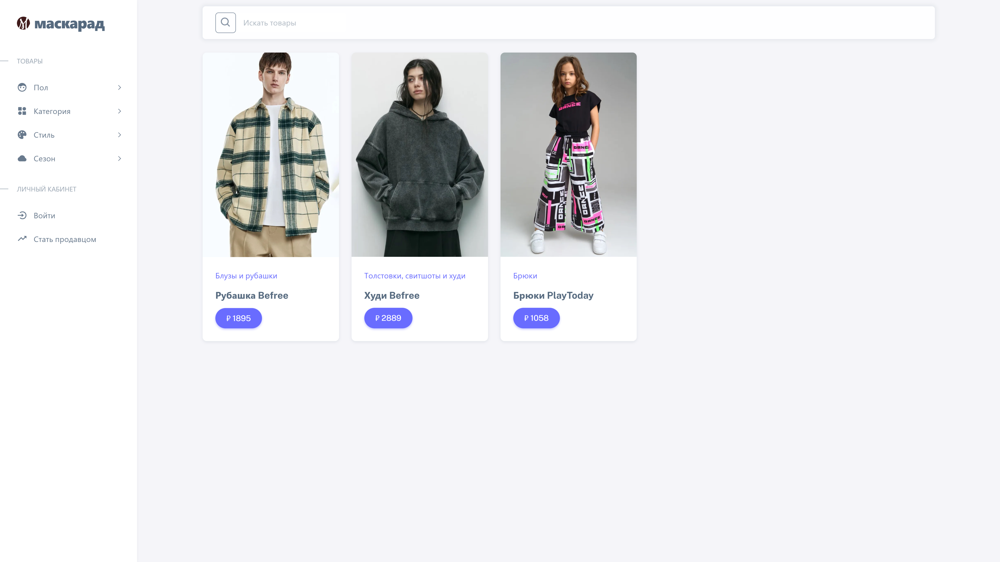
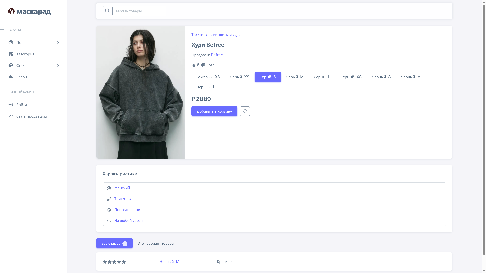
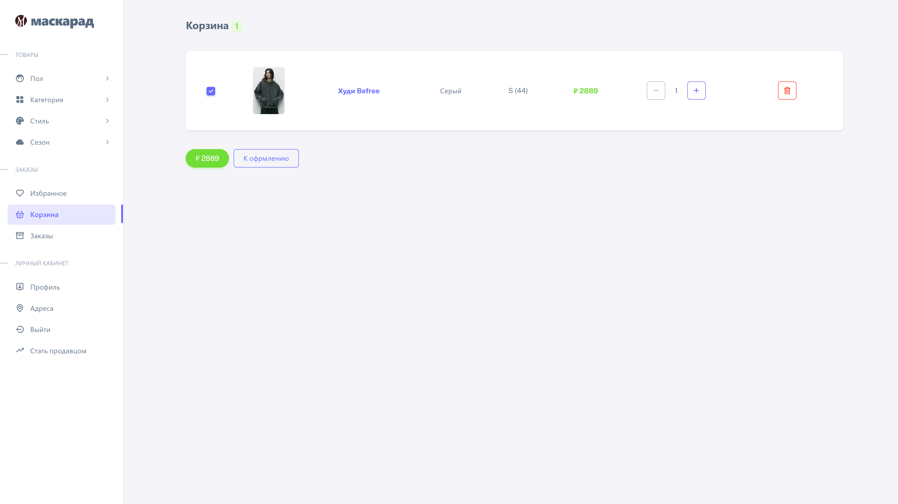

# **Online Store "Masquerade"**

**Masquerade** is a modern, user-friendly e-commerce platform designed to sell stylish and quality clothing for men, women, and children. The platform provides a seamless shopping experience with a rich product catalog, secure payment options, and an intuitive interface for both customers and sellers.

## **📌 Project Goals**
- Provide a convenient and secure online shopping environment.
- Increase conversion rates and sales volume.
- Promote and sell clothing items from a well-structured catalog.
- Attract new customers and retain existing ones.

## **👥 Team**
- **Islam Ismailov** – Project Manager, Technical Writer
- **Maria Fedorova** – Analyst
- **Polina Shcherbakova** – Tester
- **Minh Hang Tran** – Developer

## **🎯 Key Features**
### **For Customers:**
- Product catalog with photos, descriptions, and categories
- Shopping cart with editing capabilities
- Order history and tracking
- Search and filtering
- Wishlist functionality

### **For Sellers:**
- Product listing and management
- Sales history and statistics
- Order status updates
- Inventory management

## **📸 Screenshots**
### 1. Homepage 

### 2. Product Card

### 3. Shopping Cart

